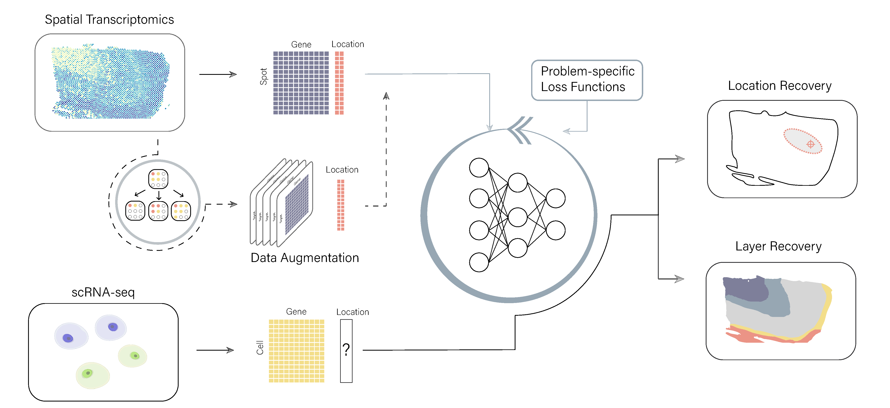

# CeLEry
## CeLEry: Cell Location Recovery in Single-cell RNA Sequencing 

### Qihuang Zhang, Jian Hu, David Dai, Edward B. Lee, Rui Xiao, Mingyao Li*

Single-cell RNA sequencing (scRNA-seq) has transformed our understanding of cellular heterogeneity in health and disease, but the lack of physical relationships among dissociated cells has limited its applications. Here we present CeLEry, a supervised deep learning algorithm to recover the spatial origins of cells in scRNA-seq by leveraging gene expression and spatial location information learned from spatial transcriptomics (ST) data. CeLEry has a data augmentation procedure via variational autoencoder to improve the robustness of the method and overcome noise in scRNA-seq. CeLEry can infer the spatial origins of cells in scRNA-seq at multiple levels, including 2D location as well as the spatial domain or tissue layer of a cell. CeLEry also provides uncertainty estimates for the recovered location information. Comprehensive evaluations on multiple datasets generated from mouse and human brains show that CeLEry can reliably recover the spatial location information for cells in scRNA-seq.



*The implmentation procedure of CeLEry*:
- CeLEry takes spatial transcriptomic data as input for the training data and the scRNA-seq as testing data set. 
- CeLEry optionally generates replicates of the spatial transcriptomic data via variational autoencoder then includes them as the training data together with original spatial transcriptomic data. 
- A deep neural network is trained to learn the relationship between the spotwise gene expression and location information, minimizing the loss functions that are specified according to the specific problem. 


## Usage

The [**CeLEry**](https://github.com/QihuangZhang/CeLEry) package is an implementation of a deep neural network in discovering location information for single cell RNA data. With CeLEry, you can:

- Preprocess spatial transcriptomics data from various formats.
- Build a deep neural network to predict cell locations.
- Generate synthetic spatial transcriptomic data.


## Tutorial


A Jupyter Notebook of the tutorial (*UNDER CONSTRUCTION*) is accessible from : 
<br>
https://github.com/QihuangZhang/CeLEry/blob/main/tutorial/tutorial.ipynb
<br>


## System Requirements
Python support packages: torch>1.8, pandas>1.4, numpy>1.20, scipy, tqdm, scanpy>1.5, anndata, sklearn, pickle, random, math, os


# Install packages
In the command, input
```
pip install -i https://test.pypi.org/simple/ CeLEryPy
```