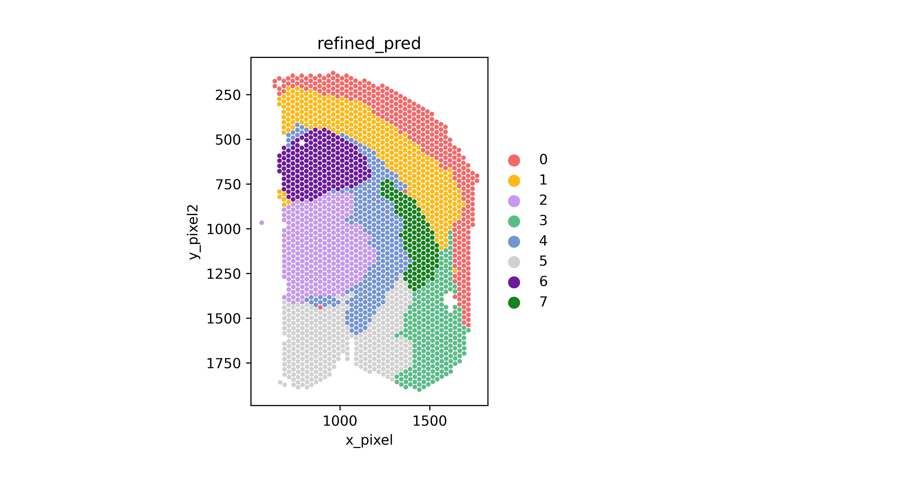
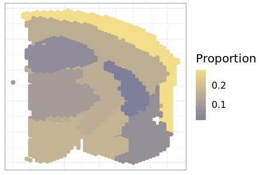

<h1><center>Biogen Pretrained Model Tutorial </center></h1>

Author: Qihuang Zhang*, Jian Hu, Kejie Li, Baohong Zhang, David Dai,
Edward B. Lee, Rui Xiao, Mingyao Li*


## Outline

1.  Preparation
2.  Load Data
3.  Prediction
4.  Visualization (in `R`)


In this tutorial, we illustrate the usage of the CeLEry pre-train model
trained by Biogene mouse brain data (Li and Zhang, 2022). This model
takes the gene expression input of 886 genes and produces a prediction
probability vector to eight regions segmented from the spatial
transcriptomics data.


The prediction model in this tutorial is pre-trained using the spatial transcripitomics data (ID 075B). The domains were segemented using ``spaGCN``:




To implement this tutorial, the CeLEry python package needs to be installed. Please see the instruction for installation.  

## 1. Preparation 

To implement this tutorial, several
helper functions are needed. 


``` {.python}
import pickle
from scanpy import read_10x_h5
import CeLEry as cel

import scanpy as sc
import numpy as np
import pandas as pd
from scipy.sparse import issparse
```


## 2. Load Data 

Load scRNA-seq/snRNA-seq data. Example data can be download from [Li and Zhang (2022)](https://doi.org/10.5281/zenodo.6640285).

``` {.python}
QueryData_raw = read_10x_h5("data/Biogen/7G-1/filtered_feature_bc_matrix.h5")
QueryData = cel.make_annData_query (QueryData_raw)
```


It is important to make sure the query scRNA-seq/snRNA-seq contains all the gene in the trained model.

``` {.python}
## Load gene list
filename = "pretrainmodel/Biogen/Reference_genes_8_075B.obj"
filehandler = open(filename, 'rb') 
genenames = pickle.load(filehandler)

## Rearrange the data and filter the selected genes in the trained model.
Qdata = QueryData[:,list(genenames)]
cel.get_zscore(Qdata)
```

#### 3. Apply Pre-trained CeLEry model to the snRNA data

The gene expression of the first cell (a 1X886 matrix) in the snRNA-seq data is given by:

``` {.python}
Qdata[0].X.A
```

Load the CeLEry prediction model which is located at the
`"../output/Biogene/models"` named as `Org_domain_075B`. We use CeLEry
function `Predict_domain()` to conduct domain prediction for each single
cells in the scRNA-seq/snRNA-seq data. The detailed arguments are
explained as follows:

-   data_test: (AnnData object) the input scRNA-seq/snRNA-seq data
-   class_num: (int) the number of classes to be predicted. This value
    should be consistent with the number of domains in the training
    model.
-   path: (string) the location of the pre-trained model
-   filename: (string) the file name of the saved pre-trained model
-   predtype: (string) if predtype is \"probability\" (default) then a
    probability prediction matrix will be produced; if predtype is
    \"deterministic\", then the deterministic assignment based on the
    maximum probability prediction will be returned; if predtype is
    \"both\", then both predictions will be outputed.

## 3. Prediction

Prediction of the first cell

``` {.python}
model_location = "pretrainmodel/Biogen/Pretrained_model_075B.obj"

pred_cord = cel.Predict_domain(data_test = Qdata[0], class_num = 8, path = "pretrainmodel/Biogen", filename = "Pretrained_model_075B", predtype = "probability")
```


Predict region labels of the entire scRNA-seq data and report the proportion of the cells on each domain.

``` {.python}
pred_cord_all = cel.Predict_domain(data_test = Qdata, class_num = 8, path = "pretrainmodel/Biogen", filename = "Pretrained_model_075B", predtype = "deterministic")

prop_count = pd.DataFrame(pred_cord_all).value_counts().sort_index()
prop_weight = prop_count/sum(prop_count)
prop_weight
prop_weight.to_csv("output/Biogen/prop_8_075B_7G-1.csv")
```

The output of this example is:

```
0	0.280068876
1	0.155832975
2	0.102539819
3	0.066465777
4	0.151183814
5	0.169436074
6	0.056048214
7	0.018424451
```
The first column corresponds to the domain in the training spatial transcriptomics data as in the previous figure. The second column reports the proportion of the cells located in different regions.


## 4. Visualization

For the following part, we use the `ggplot()` in `R` to visualize the
proportion predicted according to CeLEry. We are going to use the
regions segmented from the spatial transcriptomics data to illustrate
what the distribution looks like.

### 4.1 R packages

``` {.R}
library(ggplot2)
library(png)

outputdir <- "output/Biogen/plots/"
```


### 4.2 Plotting Functions

The Density plot function use two input paths.

-   `obsdata_path` specifies the path of the observation data from the
    spatial transcriptomics data that are used to train the data,
    which are saved from the \".obs\" of the annotated data object in
    python. These files contain the spot ID, the locations of the spots,
    and the region ID, and will be used as the background of
    the visualization.

-   `prediction_path` specifies where the path of the prediction results
    locate.

-   `objectname` specifies the name of the output figure.

``` {.R}
obsdata_path = "output/Biogen/obsdata_8_075B.csv"
prediction_path = "output/Biogen/prop_8_075B_7G-1.csv"
objectname = "BiogenExample"

Density_plot <- function(obsdata_path, prediction_path, objectname){
  obsdata <- read.csv(obsdata_path, header = T)
  maxx <- max(obsdata$x_cord)
  obsdata$minus_xcord <- maxx - obsdata$x_cord
  pred_CeLEry <- read.csv(prediction_path, header = T)
  colnames(pred_CeLEry) = c("Domain", "Density")
  dataplot <- merge(obsdata, pred_CeLEry, by.x = "refined_pred", by.y = "Domain")
  png(file = paste0(outputdir,"Density_plot_",objectname,".png"), height = 300, width = 450)
  DensityPlot2D  <- ggplot(dataplot, aes(x = x_cord, y = y_cord) )  + 
    theme_bw()  + 
    geom_point(aes(color = Density), size = 3) + #shape = 21, color = "black",, stroke = 0.3
    # scale_y_reverse() +
    scale_color_gradient(low = "#7E7F9A", high = "#F3DE8A") +
    theme(text=element_text(size=20, family="URWHelvetica"), axis.text = element_blank(),
           axis.ticks=element_blank(),
           panel.spacing = unit(1, "lines")) +
    theme(strip.background =element_rect(fill="#3F4536",color="#3F4536"))+
    theme(strip.text = element_text(colour = 'white')) +
    theme(panel.border = element_rect(colour = "#3F4536"))  +
    labs(x = NULL, y = NULL, color = "Proportion")
  print(DensityPlot2D)
  dev.off()
}

Density_plot(obsdata_path, prediction_path, objectname)
```

The output figures display the proportion of cells in the regions
segmented in the training data.


